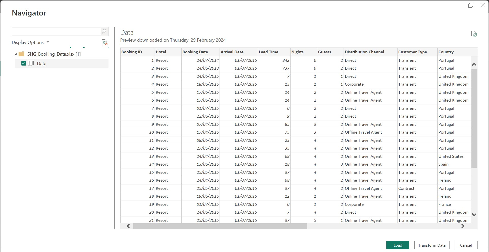

# SplendorHotelBookingAnalytics

## Introduction
As a newly recruited Business Intelligence Analyst and Data Analyst for **Splendor Hotel Group**, I am tasked with analyzing and deriving insights from our booking data. This project focuses on thoroughly examining the past booking data of one of our premier resorts to identify trends, understand consumer behavior, and provide actionable suggestions for strategic decision-making.

Purpose: Analyzing booking data is crucial for **Splendor Hotel Group** as it enables us to optimize pricing strategies, refine marketing campaigns, and enhance overall customer satisfaction.

Impact: The insights generated from this analysis have the potential to drive significant cost savings, revenue growth, and operational efficiencies across the organization.

**_Disclaimer_**: _Splendor Hotel Group and the datasets used in this project are entirely fictional. This project serves as a demonstration of the capabilities of data analysis tools like Power BI and is not based on real-world data._

## Objectives of the Analysis:

1. Booking Patterns:
- What is the trend in booking patterns over time, and are there specific seasons or months with increased booking activity?
- How does lead time vary across different booking channels, and is there a correlation between lead time and customer type?

2. Customer Behavior Analysis:
- Which distribution channels contribute the most to bookings, and how does the average daily rate (ADR) differ across these channels?
-  Can we identify any patterns in the distribution of guests based on their country of origin, and how does this impact revenue?

## Skills Demostrated :
- Data Cleaning
- Data Modeling
- DAX
  
## Data Extraction, Transformation and Loading

The Excel file was Extracted to Power BI for Transformation

The file was Transformed with the Power Query Editor, to remove duplicates, change data types(e.g the  booking_id column to text data type from numeric data type since it will not be use for any calculations).

## Data Modeling

The data model follows a star schema design, consisting of 2-dimensional tables and 1 fact table. The dimension tables represent various aspects of the booking data, while the fact table serves as the central hub for analyzing booking transactions. 

All dimension tables are joined to the fact table using one-to-many relationships, enabling seamless integration of data across different dimensions. Additionally, a date table has been created to facilitate time-based analysis and enable dynamic time intelligence calculations.

This star schema architecture optimizes query performance and simplifies complex analysis tasks, providing a solid foundation for exploring booking trends and performance within the **Splendor Hotel Group** dataset.

Upon completion, the file was loaded and prepared for analysis and visualization. The analysis was conducted to gain a deeper understanding of the company's data and to formulate actionable recommendations.

To gain further insights from the data, the following measures were created:

- **ADR (Average Daily Rate)**: Calculated as the average of the ad_rate column in the fact table.
- **Booking Counts**: Determined by counting the number of unique booking IDs in the bookings table.
- **Total Revenue**: Computed as the sum of the revenue column in the fact table.

These measures provide key metrics for assessing performance, revenue generation, and booking trends within the dataset.
